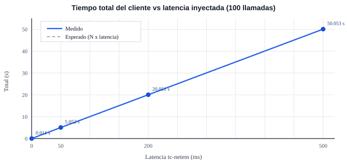

# Laboratorio N.º 1: Midiendo las falacias

Asignatura: Sistemas Distribuidos, Universidad de Los Lagos
Equipo: SD-Jaune-Asencio — Diego Jaune y Sebastian Asencio
Fecha del laboratorio: 28-08-2026
Fecha del informe: 02-09-2026

---

## 1. Entorno y método

El laboratorio se ejecutó en un notebook con procesador AMD Ryzen 9 270, 32 GB de RAM y Windows 11 Home. Se utilizó Docker Desktop 29.7.2 y Docker Compose v5.4.0. El sistema estaba compuesto por dos contenedores, `cliente` y `servidor`, conectados mediante la red Docker `sd_net`.

El cliente realizó 100 llamadas TCP consecutivas al servidor en el puerto 5000, enviando `PING n` y esperando como respuesta `PONG n`. Primero se midió la línea base con `ping` e `iperf3`. Luego se realizaron pruebas con latencias de 50, 200 y 500 ms utilizando `tc-netem`, y finalmente con pérdidas de paquetes de 1 %, 5 %, 20 % y 100 %.

Para las pruebas de latencia, el tiempo esperado se calculó como 100 × latencia configurada. `tc-netem` funcionó correctamente, por lo que no fue necesario utilizar el Plan B.

## 2. Resultados

La línea base presentó un RTT promedio de 0,062 ms y un throughput de 22,7 Gbit/s.

### Latencia inyectada — 100 llamadas

| Latencia `tc` | Total (s) | Promedio (ms) | Máximo (ms) | Esperado |
| ------------- | --------- | ------------- | ----------- | -------- |
| 0 ms          | 0,011     | 0,1           | 0,6         | ≈ 0 s    |
| 50 ms         | 5,052     | 50,5          | 51,2        | 5 s      |
| 200 ms        | 20,051    | 200,5         | 200,9       | 20 s     |
| 500 ms        | 50,053    | 500,5         | 501,1       | 50 s     |

### Pérdida de paquetes

| Pérdida `tc` | Throughput `iperf3` | Tiempo cliente | Observación                                               |
| ------------ | ------------------- | -------------- | --------------------------------------------------------- |
| 1 %          | 10,9 Gbit/s         | 0,216 s        | La comunicación continuó funcionando con retransmisiones. |
| 5 %          | 283 Mbit/s          | 0,421 s        | Disminuyó considerablemente el throughput.                |
| 20 %         | 5,24 Mbit/s         | 9,641 s        | La pérdida produjo una fuerte degradación.                |
| 100 %        | `Errno 113`         | No completó    | El cliente indicó `No route to host`.                     |

## 3. Observado versus esperado

Los resultados de latencia coincidieron casi exactamente con los valores calculados. Con 50, 200 y 500 ms se obtuvieron tiempos totales de 5,052, 20,051 y 50,053 segundos. Esto muestra una relación prácticamente lineal, ya que cada llamada espera la respuesta anterior antes de continuar.

Las pequeñas diferencias respecto al valor esperado se deben al procesamiento de los mensajes, TCP, Docker y el sistema operativo. Los valores máximos también se mantuvieron cercanos al promedio porque se utilizó un delay fijo.

Con pérdida de paquetes el comportamiento fue diferente. TCP intenta recuperar los paquetes perdidos mediante retransmisiones, por lo que el rendimiento disminuye aunque la aplicación continúe funcionando. El throughput pasó de 22,7 Gbit/s sin pérdida a 10,9 Gbit/s con 1 %, 283 Mbit/s con 5 % y solo 5,24 Mbit/s con 20 %.

Con 100 % de pérdida, nuestro entorno informó `No route to host` en lugar de mantener al cliente esperando indefinidamente. Aunque el comportamiento fue distinto al indicado en la guía, igualmente demuestra que una comunicación de red puede fallar y que la aplicación debe manejar esa situación.

## 4. La falacia que asumimos

La falacia observada fue «la latencia es cero». Aunque el cliente y el servidor se ejecutaban localmente, en el mismo equipo, igualmente existió un pequeño tiempo de comunicación. En la prueba base se obtuvo un RTT promedio de 0,062 ms, y el cliente demoró 0,011 segundos en completar las 100 llamadas. Esto demuestra que, incluso en un entorno local, la comunicación entre procesos no es instantánea. La latencia se debe al procesamiento de los mensajes, al uso de TCP, a la red virtual de Docker y al sistema operativo. Al aumentar artificialmente la latencia a 50, 200 y 500 ms, el tiempo total también aumentó de forma casi lineal. Por lo tanto, una aplicación distribuida no debería asumir que comunicarse con otro proceso tiene costo cero, incluso cuando ambos se encuentran en el mismo equipo. En una red real, esta latencia puede ser mucho mayor y afectar directamente el tiempo de respuesta de la aplicación.

## 5. Relación con la investigación de la Evaluación 1

La aplicación investigada por el equipo es una aplicación de mensajería instantánea. La falacia «la latencia es cero» también está presente en este tipo de sistemas, ya que se podría asumir que un mensaje enviado llegará de forma inmediata al destinatario. Sin embargo, toda comunicación por red tiene un tiempo de respuesta. Este puede variar dependiendo de la distancia al servidor, la calidad de la conexión, la congestión de la red y el procesamiento necesario para enviar y recibir el mensaje.

Esta latencia puede afectar la experiencia del usuario, especialmente cuando aumenta y los mensajes tardan más de lo esperado en aparecer como enviados o recibidos. Por esto, una aplicación de mensajería debe considerar estos tiempos y mostrar claramente estados como pendiente, enviado y recibido.

El laboratorio permitió comprobar este comportamiento: incluso trabajando localmente, existió una pequeña latencia y, al aumentarla artificialmente, también aumentó el tiempo necesario para completar las comunicaciones. Por lo tanto, una aplicación distribuida no debe asumir que la comunicación entre sus componentes es instantánea.
